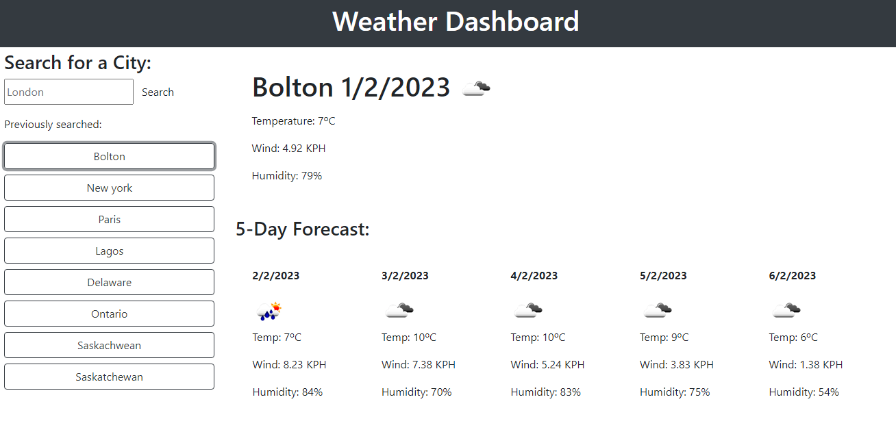

# Weather Forecast Dashboard

## Description
This is a JavaScript application that allows users to view the 5-day weather forecast for a specific city. The application uses the OpenWeatherMap API to retrieve weather data and displays the following information:

- Date
- Icon representation of weather conditions
- Temperature
- Wind
- Humidity

## Getting Started
To get started with this application, you will need to have a basic understanding of HTML, CSS, and JavaScript.

## Prerequisites
You will need to have a text editor installed on your computer to make changes to the code. Some popular text editors include:

- Visual Studio Code
- Sublime Text
- Atom
You will also need a web browser to run the application.

## Installation
1. Clone the repository or download the ZIP file to your computer.
2. Open the project in your text editor.
3. Open the index.html file in your web browser.

## Usage
Enter the name of a city in the input field and click on the "Search" button.
The application will retrieve the 5-day weather forecast for that city and display the information in the form of a forecast table.
## Built With
- HTML
- CSS
- JavaScript (jQuery)
- OpenWeatherMap API

## Screenshot

